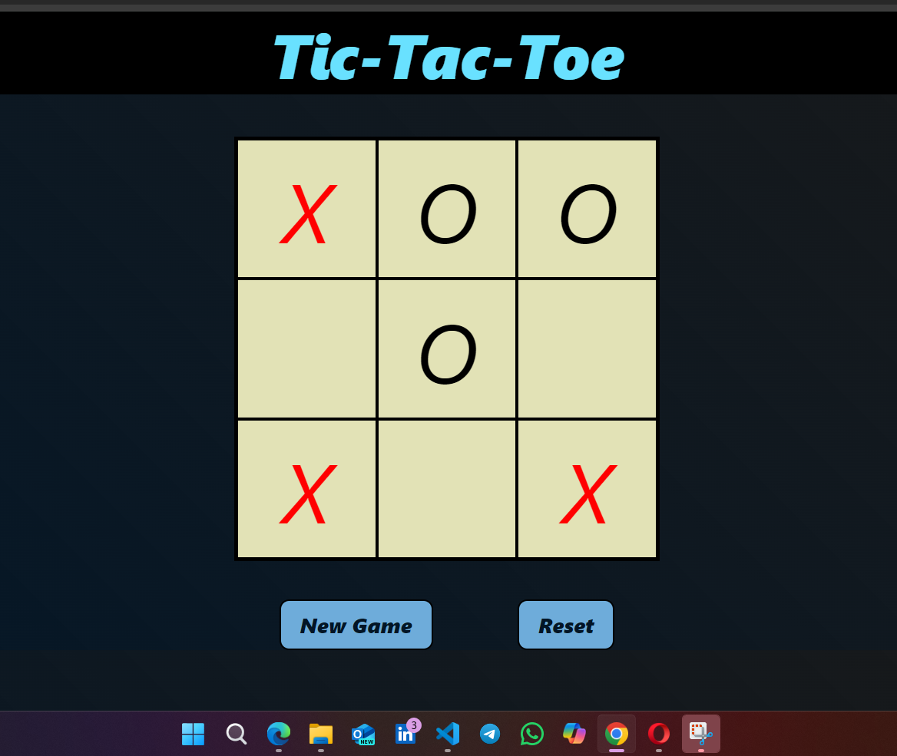
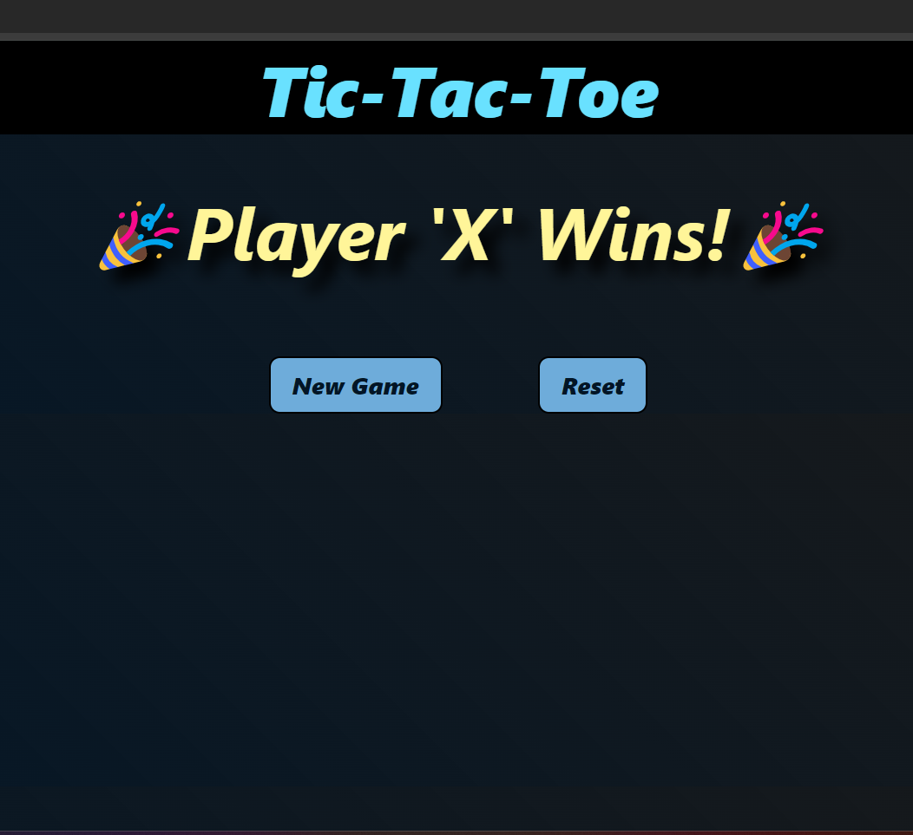
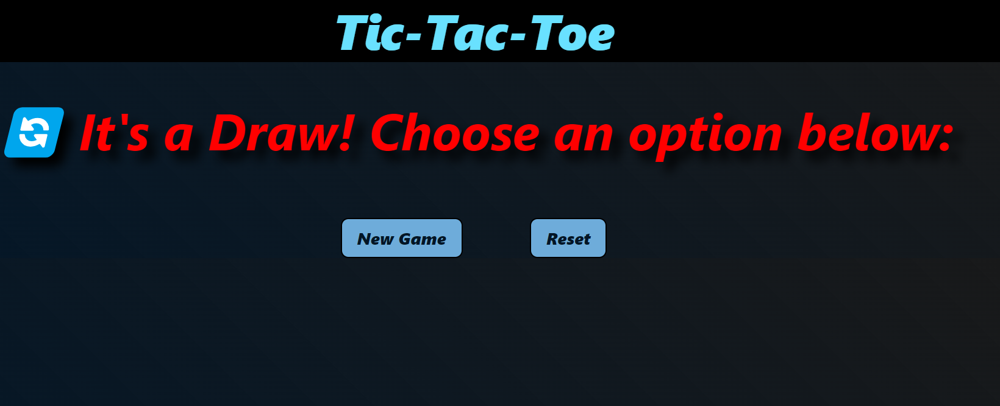

# Tic-Tac-Toe

This is a simple Tic-Tac-Toe game created using HTML, CSS and JavaScript. It's a classic game where two players take turns marking the spaces in a 3x3 grid. The game ends when one player gets three in a row or all the spaces are filled.

The game can be played by clicking on the grid cells. The player who gets three in a row wins the game. The game also includes a reset button that resets the game back to its initial state.

The game uses Tailwind CSS for styling and Google Fonts for the font.

## Image

## How to play

1. Click on any of the empty cells in the grid.
2. The player who clicked on the cell will have their turn marked with their symbol (X or O).
3. The game continues with the other player until one player gets three in a row or all the cells are filled.
4. To reset the game, click on the "New Game" button.

## Technologies Used

- HTML
- CSS
- JavaScript
- Tailwind CSS
- Google Fonts
